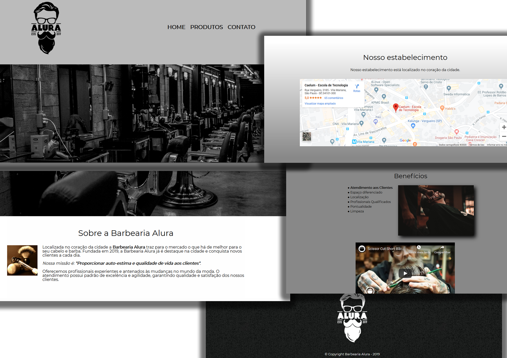
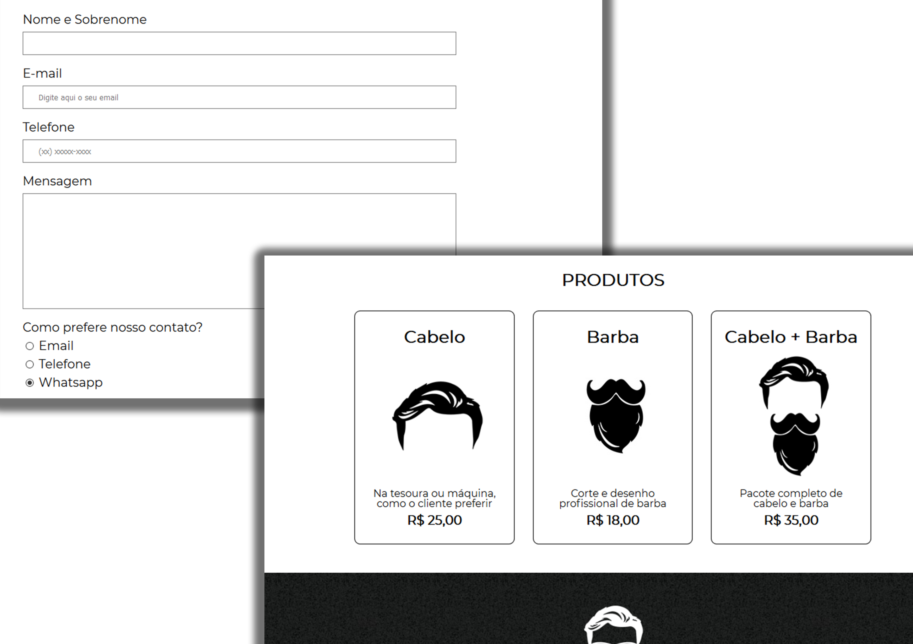

<h1 align="center">
 
<h3 align="center"> Home </h3>

 
<h3 align="center"> Produtos e Contato </h3>

 
 
Alura BarberShop
</h1>

Site feito durante os cursos de HTML e CSS (Parte 1 a Parte 4) da Alura

Site utiliza apenas de HTML e CSS, o curso foi bastante útil para relembrar algumas funcionalidades esquecidas em relação ao HTML.